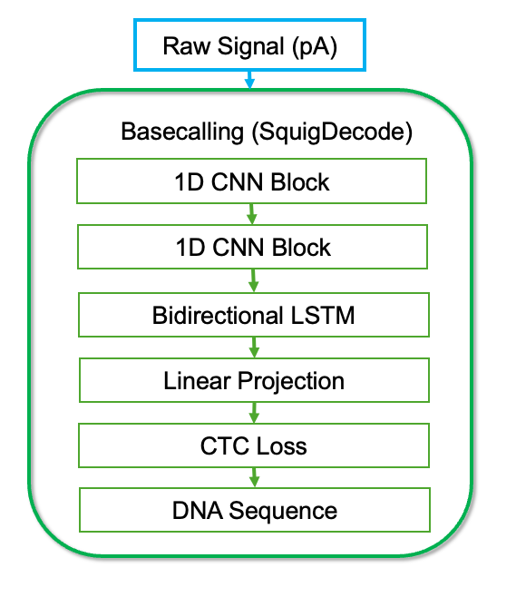
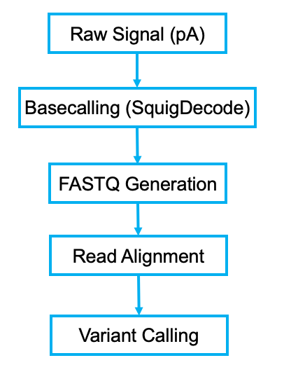

# 🧬 SquigDecode: Deep Learning Basecaller
## A CNN-BiLSTM Hybrid for Nanopore Signal Transduction

SquigDecode is a deep learning–based basecaller designed to translate raw electrical current signals ("squiggles") generated during nanopore sequencing into nucleotide sequences (A, C, G, T).

The project simulates the physics of DNA translocation through a nanopore and implements a Convolutional Recurrent Neural Network (CRNN) to decode current signals into DNA sequences.

This repository demonstrates how signal processing, deep learning, and probabilistic sequence decoding can be combined to solve the basecalling problem in nanopore sequencing.


------------------------------------------------
## Project Overview

Nanopore sequencing measures electrical current changes as DNA molecules pass through a biological pore. These signals must be decoded into nucleotide sequences through computational basecalling algorithms.

SquigDecode implements a simplified research basecaller that performs:

1. Signal simulation and preprocessing

2. Deep neural network–based sequence modeling

3. CTC-based sequence decoding

4. Model validation and signal analysis

------------------------------------------------
## 🏗️ Architecture: SquigNet
SquigDecode uses a CNN–BiLSTM hybrid architecture optimized for sequential signal decoding.

The model processes 1D electrical current signals (picoampere measurements) and converts them into nucleotide predictions.

Architecture Pipeline:

<p align="center">
  
</p>


------------------------------------------------
## Model Components
### 1. Signal Processing

Raw nanopore signals are preprocessed to stabilize model training.

Steps include:

- signal scaling and normalization

- Gaussian noise modeling

- temporal normalization

The simulator mimics signal variability observed during DNA translocation through nanopores.

### 2. Feature Extraction (CNN Layers)

Two stacked 1D convolutional blocks extract local features from the electrical signal.

Layer structure:

```Conv1D → BatchNorm → ReLU → MaxPool```

Purpose:

- reduce signal noise

- capture local current signatures

- perform temporal downsampling

### 3. Sequence Modeling (Bidirectional LSTM)

Two stacked Bidirectional LSTM layers capture long-range dependencies in the signal.

Nanopore signals typically represent k-mer windows (≈3–5 bases) rather than individual nucleotides. Bidirectional context helps infer nucleotide identity from overlapping signal patterns.

### 4. Sequence Decoding

The final stage maps hidden states to nucleotide predictions.

Components:

- Linear projection layer

- Connectionist Temporal Classification (CTC) loss

- Greedy decoding during inference

- CTC allows the model to learn sequence alignment implicitly and handle variable-length signals.

------------------------------------------------
## Design Decisions
### Why CNN + BiLSTM?

Nanopore signals contain both:

- local signal patterns corresponding to nucleotide transitions

- long-range dependencies caused by the multi-base sensing window of the pore

The architecture therefore separates responsibilities:

| Component    | Purpose                                                 |
| ------------ | ------------------------------------------------------- |
| CNN layers   | extract local signal features and reduce noise          |
| BiLSTM       | capture long-range sequence dependencies                |
| CTC decoding | align variable-length signals with nucleotide sequences |

This design follows the CRNN paradigm widely used in speech recognition and nanopore basecalling systems.

### Why Temporal Downsampling?

The CNN layers reduce signal resolution:

```800 samples → 200 samples```

This 4× reduction significantly reduces computational load on the recurrent layers while preserving sufficient temporal resolution to distinguish similar current levels.

### Why CTC Loss?

Connectionist Temporal Classification enables:

- alignment-free training

- handling of variable-length sequences

- implicit learning of signal-to-base alignment

This technique is widely used in sequence transcription tasks.


------------------------------------------------
## Performance

Training and evaluation were performed on simulated nanopore signals.

Best Training Loss: 0.1328 at Epoch 47

Mean Basecalling Accuracy: 95.93% on the test dataset

### Robustness Testing

To evaluate model stability, additional Gaussian noise was introduced.

Noise level: σ = 0.3

Accuracy: ~85%

This experiment demonstrates the impact of distribution shift, highlighting the importance of data augmentation and robust training strategies for production sequencing systems.

### Training Behavior

The model converges rapidly.

Key observation: The loss drops below 0.2 by Epoch 6, indicating efficient learning of signal-to-base mappings.

------------------------------------------------
## Key Technical Insights
### Distribution Shift Sensitivity

Adding noise to the signal reveals significant performance degradation.

This reflects a real-world challenge in nanopore sequencing: models trained on ideal signals may struggle with noisy experimental data.

Potential mitigation strategies:

- noise augmentation

- domain randomization

- adaptive normalization

### Temporal Resolution Trade-off

The CNN reduces signal resolution:

```800 samples → 200 samples```

This significantly reduces the computational burden of the recurrent layers while preserving enough signal structure for accurate basecalling.


------------------------------------------------
## Position in a Nanopore Sequencing Pipeline

In real sequencing workflows, basecalling is the first computational stage.

Typical pipeline:

<p align="center">
  
</p>


Common downstream tools include:

- Minimap2 for read alignment

- SAMtools for read processing

- GATK for variant discovery

Basecalling accuracy directly impacts downstream alignment and variant detection performance.


------------------------------------------------
## Benchmark Context

Modern nanopore basecallers rely on deep learning architectures to decode electrical signals.

Examples include:

- Guppy

- Bonito

SquigDecode is designed as a research prototype that demonstrates the core components used in these systems:

- convolutional feature extraction

- recurrent sequence modeling

- probabilistic decoding with CTC

Production systems typically include additional optimizations such as GPU acceleration and transformer architectures.

------------------------------------------------
## Project Structure

```
SquigDecode/
├── src/
│   ├── architecture.py      # SquigNet model definition
│   ├── data_simulator.py    # Physics-based signal generator
│   ├── train.py             # Training pipeline using CTC loss
│   ├── inference.py         # Greedy decoding and evaluation
│   └── config.py            # Default configuration parameters
│
├── tests/                   # Unit tests for signal simulation and preprocessing
├── data/                    # Reference signals and datasets
├── models/                  # Trained model checkpoints
├── results/                 # Evaluation figures and results
├── notebooks/               # Signal analysis notebooks
│
├── input.json               # User-configurable parameters
├── requirements.txt         # Python dependencies
├── pyproject.toml           # Project metadata
└── README.md    
```

------------------------------------------------
## Running the Project

1. Install Dependencies: 
   ```
   pip install -e . 
   or 
   pip install -r requirements.txt
   ```
2. Train the Model: 
   `python src/train.py`

3. Run Inference: 
   `python src/inference.py`


------------------------------------------------
## Research Motivation

Basecalling converts raw electrical signals from nanopore sequencing into nucleotide sequences. This step is essential for downstream genomic analysis.

SquigDecode provides a simplified framework for exploring the algorithmic challenges of signal-to-sequence decoding, combining signal processing, neural networks, and probabilistic sequence modeling.


------------------------------------------------
## Future Directions

Potential extensions include:

transformer-based sequence models

beam search decoding

training on real nanopore datasets

improved noise augmentation strategies

GPU acceleration for large-scale training

------------------------------------------------
## License

MIT License – feel free to use, adapt, and share.
